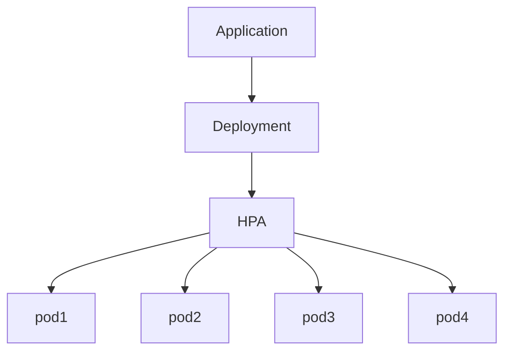

# Using HPA

HPA resource is used to scale up number of pods upon increase in traffic, based upon configuration of replicas in HPA resource.

HPA resource requires metrics-server to be enabled on the cluster.

Documentation on [HPA](https://kubernetes.io/docs/tasks/run-application/horizontal-pod-autoscale-walkthrough/) 



- Create a deployment-

```jsx
apiVersion: apps/v1
kind: Deployment
metadata:
  labels:
    app: nginx-deployment
  name: nginx-deployment
spec:
  replicas: 1
  selector:
    matchLabels:
      app: nginx-deployment
  strategy: {}
  template:
    metadata:
      labels:
        app: nginx-deployment
    spec:
      containers:
      - image: nginx:1.21.6
        name: nginx
        ports:
        - containerPort: 80
        resources:
          limits:
            cpu: 100m
            memory: 128Mi
          requests:
            cpu: 100m
            memory: 128Mi
status: {}

```

- Create a service

```jsx
apiVersion: v1
kind: Service
metadata:
  name: nginx-service
spec:
  selector:
    app: nginx-deployment
  ports:
    - protocol: TCP
      port: 80
      targetPort: 80
  type: LoadBalancer
```

- Enable HPA on minikube or on any cluster

```jsx
minikube addons enable metrics-server
 
# Or

kubectl apply -f https://github.com/kubernetes-sigs/metrics-server/releases/latest/download/components.yaml
```

- Create HPA resource

```jsx
apiVersion: autoscaling/v1
kind: HorizontalPodAutoscaler
metadata:
  name: nginx-hpa
  namespace: default
spec:
  scaleTargetRef:
    apiVersion: apps/v1
    kind: Deployment
    name: nginx-deployment
  minReplicas: 1
  maxReplicas: 10
  targetCPUUtilizationPercentage: 50
```

- Generate load to trigger scaling

```jsx
kubectl run -i --tty load-generator --rm --image=busybox --restart=Never -- sh -c "while sleep 0.01; do wget -q -O- http://nginx-service.default.svc.cluster.local; done"
```

- Observe the scaling

```jsx
kubectl get hpa --watch
kubectl get pods --watch
```