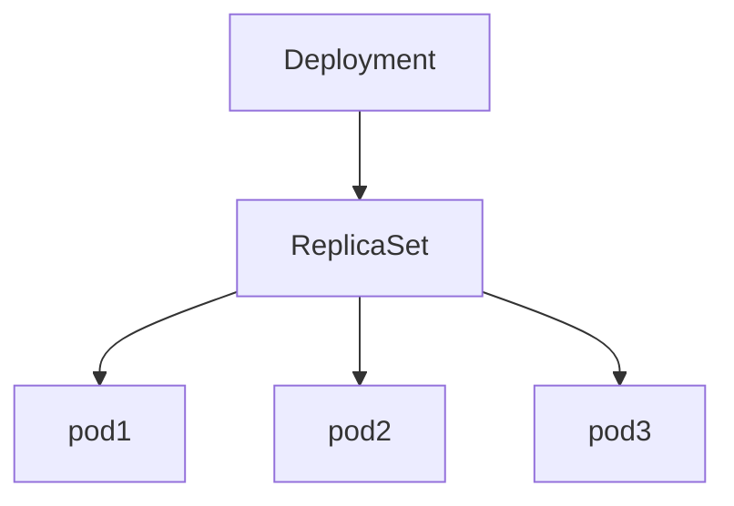

## Manually scaling

- Creating deployment - `nginx-deployment` -

```jsx
apiVersion: apps/v1
kind: Deployment
metadata:
  labels:
    app: nginx-deployment
  name: nginx-deployment
spec:
  replicas: 3
  selector:
    matchLabels:
      app: nginx-deployment
  strategy: {}
  template:
    metadata:
      labels:
        app: nginx-deployment
    spec:
      containers:
      - image: nginx:1.21.6
        name: nginx
        ports:
        - containerPort: 80
        resources:
          limits:
            cpu: 100m
            memory: 128Mi
          requests:
            cpu: 100m
            memory: 128Mi
status: {}
```

HPA —> **increasing count of replicas**



- **To manually scale the number of replicas for the sample application-**
    
    ```jsx
    kubectl scale deployment nginx-deployment --replicas=3
    ```
    
- **Watch the pods getting scaled-**
    
    ```jsx
    kubectl get pods -w
    ```
    

VPA —> **Increasing the resources**

```jsx
        resources:
          limits:
            cpu: 100m
            memory: 128Mi
          requests:
            cpu: 100m
            memory: 128Mi
```

- **To manually increase the resource of a pod-**
    
    ```jsx
    kubectl patch deployment nginx-deployment -p '{"spec": {"template": {"spec": {"containers": [{"name": "my-container", "resources": {"requests": {"cpu": "500m", "memory": "512Mi"}, "limits": {"cpu": "1000m", "memory": "1Gi"}}}]}}}}'
    kubectl apply -f deployment.yaml
    
    ```
    

Or other way would be to edit the deployment and then apply